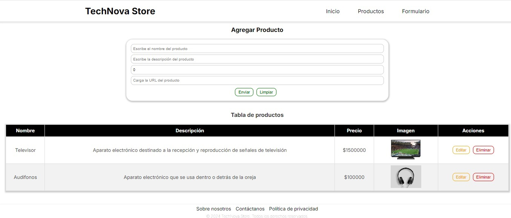
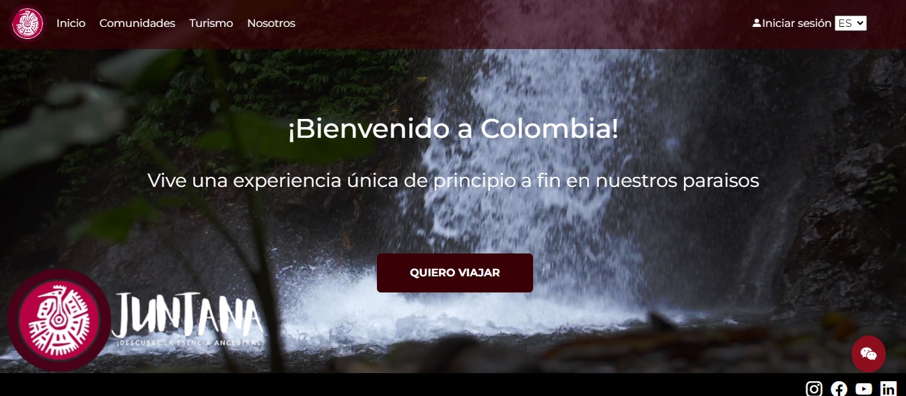
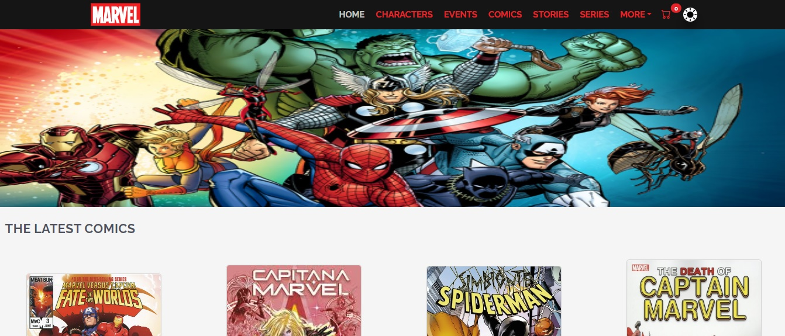
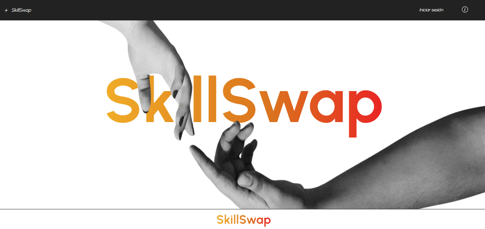

# My Portfolio

Welcome to my portfolio! This project showcases my skills as a Frontend Web Developer, featuring various projects I have worked on using technologies such as Next.js, TypeScript, and React.js.

## Table of Contents

- [About Me](#about-me)
- [Services](#technologies-used)
- [Projects](#projects)
- [Contact](#contact)

## About Me

I am a passionate Frontend Web Developer with experience in creating interactive and efficient applications. I specialize in modern technologies, including Next.js and React.js, which allow me to build scalable web solutions. I am committed to continuous learning and professional growth.

## Technologies Used

- **Frontend:** HTML, CSS, JavaScript, TypeScript, React, Next.js
- **Tools:** Git, GitHub, Visual Studio Code

## Projects

### 1. [CRUD with Next and TypeScript](https://github.com/luisaramicar11/crudProduct6)

- **Description:** A project featuring a form for adding new products and a table displaying created products. Each row in the table includes buttons for editing or deleting products.
- **Date:** 20/08/2024
- 

### 2. [Juntana](https://github.com/luisaramicar11/TourismProject)

- **Description:** Juntana connects travelers with indigenous communities in Colombia, offering personalized tourist plans that include guided visits, artisan workshops, gastronomic experiences, cultural ceremonies, and excursions to sacred natural sites. The project includes views to explore these plans, a homepage, and a payment gateway with Stripe.
- **Date:** 01/06/2024
- 

### 3. [Ecommerce](https://github.com/luisaramicar11/Marvel)

- **Description:** A responsive application that leverages services from the Marvel API to present relevant information and incorporates an e-commerce feature with Stripe payment integration.
- **Date:** 12/12/2023
- 

### 4. [SkillSwap](https://github.com/luisaramicar11/skillSwap)

- **Description:** In a constantly evolving digital environment, updating and strengthening skills is crucial. SkillSwap addresses the challenges of collaborative learning, offering a smooth and effective digital experience for knowledge exchange.
- **Date:** 30/09/2024
- 

## Contact

Feel free to reach out if you have any questions or opportunities that align with my experience:

- **Email:** [your-email@example.com](mailto:lfernanda1192@gmail.com)
- **LinkedIn:** [Your LinkedIn Profile](https://www.linkedin.com/in/luisa-fernanda-ram%C3%ADrez-cardona-0b486565/)
- **GitHub:** [luisaramicar11](https://github.com/luisaramicar11)

Thank you for visiting my portfolio!

